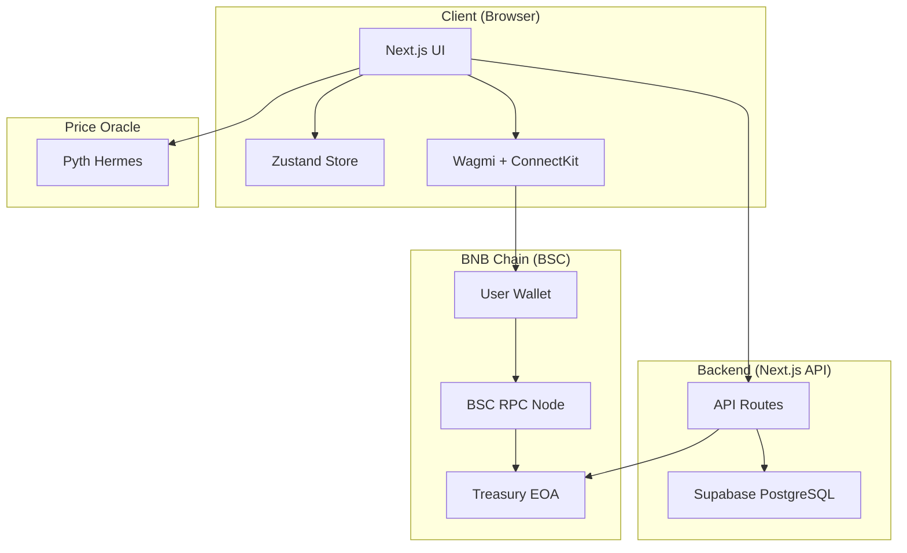
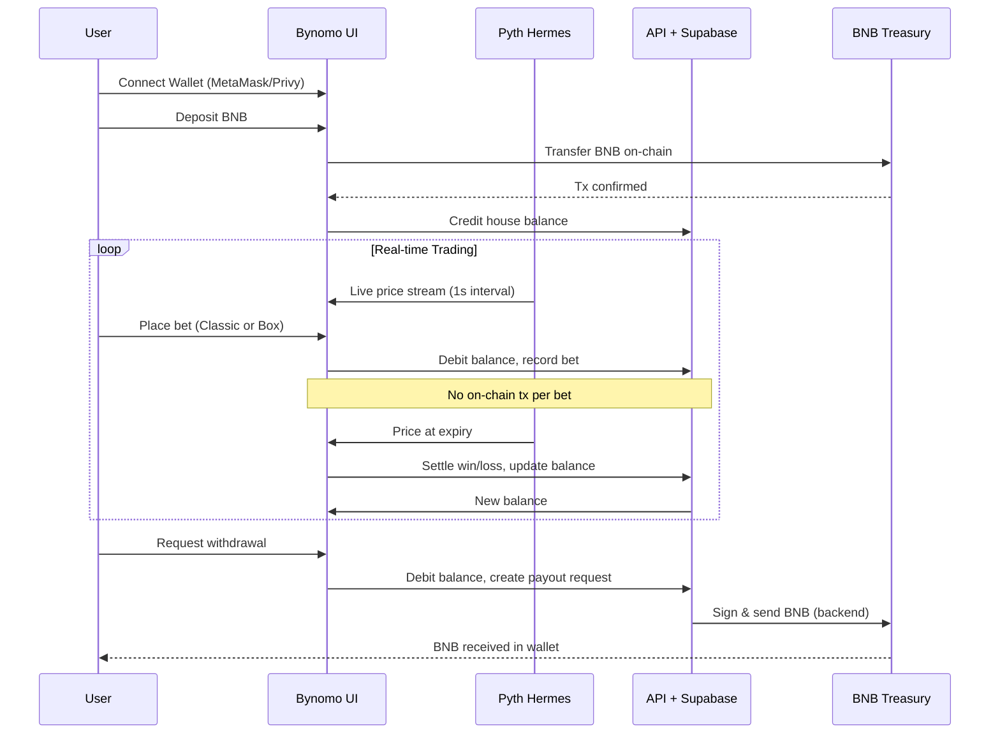

# Bynomo Developer Guide

**Comprehensive setup and development guide for contributors.**

---

## Table of Contents

1. [Prerequisites](#prerequisites)
2. [Installation](#installation)
3. [Environment Setup](#environment-setup)
4. [Database Setup](#database-setup)
5. [Running the App](#running-the-app)
6. [Testing](#testing)
7. [Architecture Overview](#architecture-overview)
8. [Development Workflow](#development-workflow)
9. [Deployment](#deployment)
10. [Troubleshooting](#troubleshooting)

---

## Prerequisites

Before you begin, ensure you have the following installed:

- **Node.js**: v18+ (recommend v20 LTS)
- **Yarn**: v1.22+ (or npm v9+)
- **Git**: For version control
- **MetaMask** or compatible wallet with BNB on BSC testnet/mainnet
- **Supabase account**: [supabase.com](https://supabase.com) (free tier works)
- **Privy account** (optional): [privy.io](https://privy.io) for social login
- **WalletConnect Project ID**: [cloud.walletconnect.com](https://cloud.walletconnect.com)

---

## Installation

### 1. Clone the repository

```bash
git clone https://github.com/0xamaan-dev/Bynomo.git
cd Bynomo
```

### 2. Install dependencies

```bash
yarn install
# or
npm install
```

This will install all required packages including:
- **Frontend**: Next.js 16, React 19, TypeScript, Tailwind CSS
- **Blockchain**: Wagmi, Viem, Ethers, ConnectKit, Privy
- **Oracle**: Pyth Hermes Client
- **Backend**: Supabase, Next.js API routes
- **Testing**: Jest, Testing Library

---

## Environment Setup

### 1. Create `.env` file

```bash
cp .env.example .env
```

### 2. Configure environment variables

Open `.env` and fill in the following:

#### BNB Chain Configuration
```bash
NEXT_PUBLIC_BNB_NETWORK=mainnet  # or testnet for staging
NEXT_PUBLIC_BNB_RPC_ENDPOINT=https://bsc-dataseed.binance.org/
NEXT_PUBLIC_WALLETCONNECT_PROJECT_ID=your_walletconnect_project_id
```

**Get WalletConnect Project ID:**
1. Go to [cloud.walletconnect.com](https://cloud.walletconnect.com)
2. Create a new project
3. Copy the Project ID

#### Privy Configuration (Optional - for Social Login)
```bash
NEXT_PUBLIC_PRIVY_APP_ID=your_privy_app_id
PRIVY_APP_SECRET=your_privy_app_secret
```

**Get Privy credentials:**
1. Sign up at [privy.io](https://privy.io)
2. Create a new app
3. Copy App ID and App Secret
4. Add `http://localhost:3000` to allowed origins

#### Treasury Configuration
```bash
NEXT_PUBLIC_TREASURY_ADDRESS=0xE7cD1B07900eB06D59E5b3B3C65033C484E41009
BNB_TREASURY_SECRET_KEY=your_treasury_private_key
```

**⚠️ SECURITY WARNING:**
- **NEVER** commit `.env` to Git
- Use a dedicated wallet for treasury (not your personal wallet)
- For production, use a multi-sig wallet (Gnosis Safe)
- Keep `BNB_TREASURY_SECRET_KEY` secure (backend only)

#### Application Configuration
```bash
NEXT_PUBLIC_APP_NAME=Bynomo
NEXT_PUBLIC_ROUND_DURATION=30          # Default round duration in seconds
NEXT_PUBLIC_PRICE_UPDATE_INTERVAL=1000 # Price refresh interval in ms
NEXT_PUBLIC_CHART_TIME_WINDOW=300000   # Chart window (5 minutes)
```

#### Supabase Configuration
```bash
NEXT_PUBLIC_SUPABASE_URL=https://your-project.supabase.co
NEXT_PUBLIC_SUPABASE_ANON_KEY=your_anon_key
```

**Get Supabase credentials:**
1. Create project at [supabase.com](https://supabase.com)
2. Go to Settings → API
3. Copy URL and `anon` public key

---

## Database Setup

### 1. Create Supabase Project

1. Go to [supabase.com](https://supabase.com)
2. Click "New Project"
3. Choose a name, database password, region

### 2. Run SQL Migrations

Navigate to **SQL Editor** in Supabase dashboard and run migrations in order:

#### Migration 1: User Profiles & Balances
```sql
-- File: supabase/migrations/001_initial_schema.sql
-- Run this first
```

Copy contents from `supabase/migrations/001_initial_schema.sql` and execute.

#### Migration 2: Bet History
```sql
-- File: supabase/migrations/002_bet_history.sql
-- Run this second
```

Copy contents from `supabase/migrations/002_bet_history.sql` and execute.

### 3. Verify Setup

Run the verification script:

```bash
npm run db:verify
```

This checks that all tables exist with correct columns and indexes.

---

## Running the App

### Development Mode

```bash
npm run dev
```

Open [http://localhost:3000](http://localhost:3000) in your browser.

The app will hot-reload when you edit files.

### Production Build

```bash
npm run build
npm run start
```

### Linting

```bash
npm run lint
```

---

## Testing

### Run All Tests

```bash
npm test
```

### Run Tests in Watch Mode

```bash
npm run test:watch
```

### Run with Coverage

```bash
npm run test:coverage
```

Coverage report will be generated in `coverage/` directory.

### Database Tests

```bash
npm run test:db
```

Tests Supabase integration and balance reconciliation.

---

## Architecture Overview

### System Architecture



### Data Flow: Bet Lifecycle



### Directory Structure

```
Bynomo/
├── app/                      # Next.js 16 App Router
│   ├── layout.tsx           # Root layout
│   ├── page.tsx             # Landing page
│   ├── trade/               # Trading interface
│   ├── profile/             # User profile
│   ├── referrals/           # Referral system
│   └── api/                 # API routes
│       ├── balance/         # Deposit, withdraw, fetch
│       └── bets/            # Save, history, leaderboard
├── components/              # React components
│   ├── game/               # GameBoard, LiveChart, BetControls
│   ├── wallet/             # WalletConnect, WalletInfo
│   ├── balance/            # DepositModal, WithdrawModal
│   └── ui/                 # Shared UI primitives
├── lib/                     # Business logic
│   ├── bnb/                # BNB Chain integration
│   ├── store/              # Zustand state management
│   ├── supabase/           # Supabase client
│   └── utils/              # Utilities (priceFeed, errors)
├── contracts/               # Solidity contracts
│   └── BynomoTreasury.sol  # Simple treasury contract
├── supabase/
│   ├── migrations/         # SQL schema migrations
│   └── scripts/            # DB utility scripts
├── public/                  # Static assets
│   └── logos/              # Asset icons
└── types/                   # TypeScript types
```

---

## Development Workflow

### 1. Create a Feature Branch

```bash
git checkout -b feature/your-feature-name
```

### 2. Make Your Changes

Follow existing code style:
- Use TypeScript (strict mode)
- Use Tailwind CSS for styling
- Use Zustand for state management
- Use server actions for mutations

### 3. Test Your Changes

```bash
npm run test
npm run lint
```

### 4. Commit with Conventional Commits

```bash
git commit -m "feat: add new asset selector UI"
git commit -m "fix: resolve balance sync issue"
git commit -m "docs: update API documentation"
```

### 5. Push and Create PR

```bash
git push origin feature/your-feature-name
```

Then create a Pull Request on GitHub.

---

## Deployment

### Vercel (Recommended)

1. **Connect GitHub repo** to Vercel
2. **Set environment variables** in Vercel dashboard
3. **Deploy**:
   ```bash
   vercel --prod
   ```

### Environment Variables in Vercel

Add all `.env` variables to Vercel project settings:
- Go to Settings → Environment Variables
- Add each variable from `.env.example`
- ⚠️ **Never expose** `BNB_TREASURY_SECRET_KEY` or `PRIVY_APP_SECRET` to client

### Custom Domain

1. Add domain in Vercel project settings
2. Update DNS records (A/CNAME)
3. SSL certificate auto-provisioned

---

## Troubleshooting

### Issue: "Module not found" errors

```bash
# Clear Next.js cache
rm -rf .next
npm install
npm run dev
```

### Issue: Supabase connection fails

- Check `NEXT_PUBLIC_SUPABASE_URL` and `NEXT_PUBLIC_SUPABASE_ANON_KEY`
- Verify Supabase project is running (not paused)
- Check RLS policies allow anonymous access

### Issue: Wallet not connecting

- Ensure `NEXT_PUBLIC_WALLETCONNECT_PROJECT_ID` is valid
- Check browser console for CORS errors
- Try clearing browser cache / cookies

### Issue: Balance not updating

- Check Supabase `user_balances` table exists
- Verify treasury address matches `.env` config
- Check API routes are returning 200 status

### Issue: Prices not loading

- Verify internet connection (Pyth Hermes requires external API)
- Check browser console for Pyth API errors
- Ensure CORS is not blocking `hermes.pyth.network`

### Issue: Tests failing

```bash
# Clear Jest cache
npm run test -- --clearCache
npm run test
```

---

## Code Style Guide

### TypeScript

- Use **strict mode** (`strict: true` in `tsconfig.json`)
- Prefer `interface` over `type` for object shapes
- Use `async/await` over `.then()` chains
- Add JSDoc comments for public functions

### React

- Use **functional components** with hooks
- Prefer **named exports** over default exports for components
- Use `useMemo` / `useCallback` for expensive computations
- Keep components under 300 lines (split if larger)

### Styling

- Use **Tailwind CSS** utility classes
- Avoid inline `style={{}}` unless dynamic values required
- Use `className` composition for conditional styles
- Keep animations smooth (60fps target)

### State Management

- Use **Zustand** for global state
- Use **React hooks** for local component state
- Avoid prop drilling (use context or store)
- Keep slices focused (wallet, game, balance, history)

---

## Performance Optimization

### Bundle Size

- Code splitting with `next/dynamic`
- Tree-shaking (remove unused imports)
- Image optimization with `next/image`

### Rendering

- Use `React.memo` for expensive list items
- Debounce price updates (currently 1s interval)
- Virtualize long lists (bet history, leaderboard)

### API Calls

- Cache responses where possible
- Use SWR or React Query for data fetching
- Implement request deduplication

---

## Security Best Practices

### Frontend

- Never store private keys in localStorage
- Validate all user inputs (amounts, addresses)
- Sanitize data before rendering (XSS protection)
- Use HTTPS in production

### Backend

- Validate all API inputs (Zod or similar)
- Use parameterized queries (prevent SQL injection)
- Rate limit API endpoints (prevent abuse)
- Encrypt sensitive data at rest

### Smart Contracts

- Use OpenZeppelin libraries for common patterns
- Implement pause mechanism for emergencies
- Add access control (Ownable, AccessControl)
- Test thoroughly before mainnet deployment

---

## Contributing

See [CONTRIBUTING.md](./CONTRIBUTING.md) for detailed contribution guidelines.

For questions, reach out on:
- **Discord**: [Join our server](#)
- **GitHub Issues**: [Report bugs or request features](https://github.com/0xamaan-dev/Bynomo/issues)

---

## Resources

- **Next.js Docs**: [nextjs.org/docs](https://nextjs.org/docs)
- **Wagmi Docs**: [wagmi.sh](https://wagmi.sh)
- **Pyth Network**: [docs.pyth.network](https://docs.pyth.network)
- **Supabase Docs**: [supabase.com/docs](https://supabase.com/docs)
- **BNB Chain Docs**: [docs.bnbchain.org](https://docs.bnbchain.org)

---

**Last Updated:** February 27, 2026
