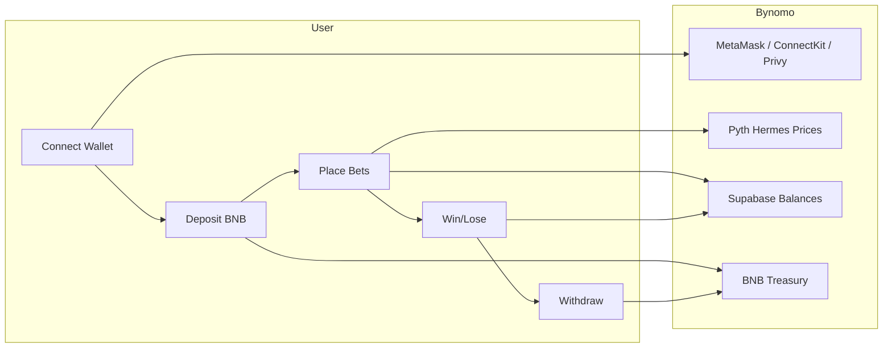
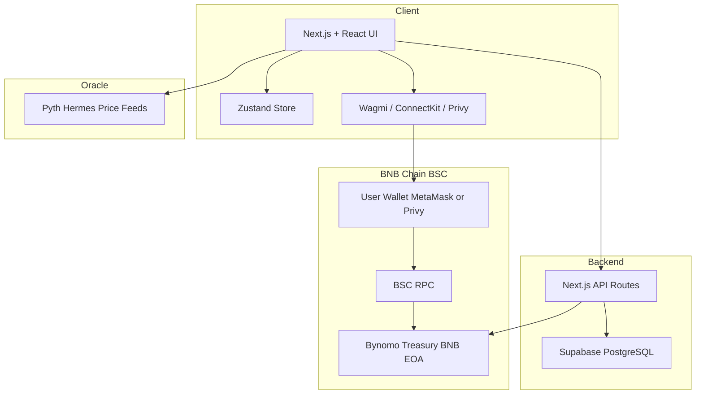
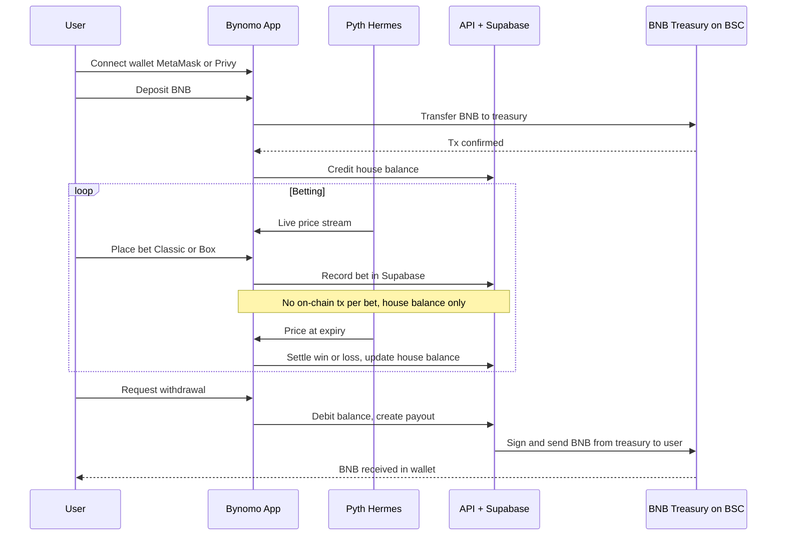
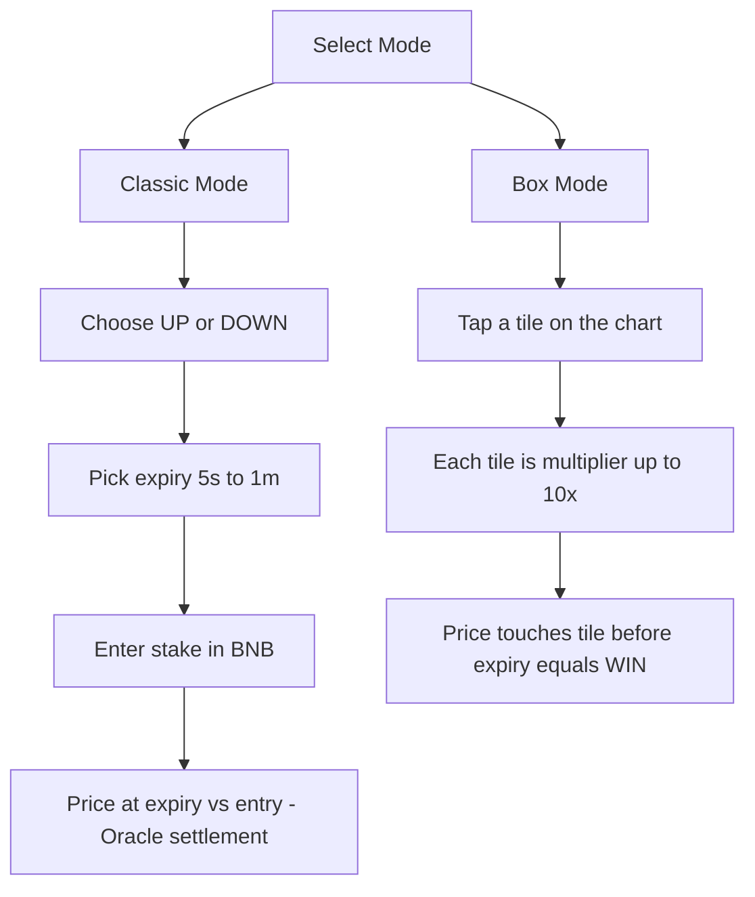

# Bynomo

[](https://opensource.org/licenses/MIT)
[](https://www.bnbchain.org/)
[](https://nextjs.org/)
[](https://www.typescriptlang.org/)

**The first on-chain binary options trading dApp on BNB Chain.**  
Running on **BNB mainnet**.

Powered by **BNB Chain (BSC)** + **Pyth Hermes** price attestations + **Supabase** + instant house balance.

*Trade binary options with oracle-bound resolution and minimal trust.*

**Main treasury (BNB Chain):** [`0xE7cD1B07900eB06D59E5b3B3C65033C484E41009`](https://bscscan.com/address/0xE7cD1B07900eB06D59E5b3B3C65033C484E41009)

---

## Evaluation repository

**This public GitHub repository is the single source used for all evaluations.** It contains:

| Content | Location |
|--------|----------|
| **Core code** | `app/`, `components/`, `lib/`, `supabase/`, `scripts/` — full Next.js app, BNB integration, Pyth, Supabase |
| **README** | This file — overview, quick start, tech stack, architecture, getting started |
| **Architecture & flow (`.md` + Mermaid)** | **README.md** (How It Works, System Architecture, Data Flow, Game Modes) · **docs/TECHNICAL.md** (architecture, setup, demo) · **docs/PROJECT.md** (problem, solution, user journey) · **docs/BNB_CHAIN_6_MONTH_PLAN.md** (6-month BNB Chain plan) · **USER_JOURNEY.md** (onboarding, deposit, Classic/Box, withdrawal, lifecycle) · **DEVELOPER_GUIDE.md** (component diagram, sequence diagram) · **ROADMAP.md** (timeline) |

All architectural and flow diagrams are in Markdown using [Mermaid](https://mermaid.js.org/) (rendered on GitHub). No evaluation materials live outside this repo.

---

## 📚 Documentation

- **[Quick Start](#getting-started)** - Get up and running in 5 minutes
- **[Developer Guide](./DEVELOPER_GUIDE.md)** - Comprehensive setup and contribution guide
- **[Roadmap](./ROADMAP.md)** - Product roadmap and milestones
- **[6-month plan on BNB Chain](./docs/BNB_CHAIN_6_MONTH_PLAN.md)** - Dedicated BNB Chain launch, scale, token & DAO plan
- **[User Journey](./USER_JOURNEY.md)** - End‑to‑end trader flow and UX
- **[Deployment addresses](./docs/bsc.address.json)** - Contracts & URLs (`bsc.address` + JSON in `docs/`)
- **[Dependencies & credits](./DEPENDENCIES.md)** - Open-source dependencies and acknowledgements
- **[Contributing](./CONTRIBUTING.md)** - How to contribute
- **[Security](./SECURITY.md)** - Security policy and vulnerability reporting

**Open source:** This repository is public and **fork-friendly**. The project is licensed under [MIT](./LICENSE); see the [LICENSE](./LICENSE) file for the full text.

---

## Repository structure

| Path | Purpose |
|------|--------|
| `app/` | Next.js App Router pages and API routes |
| `components/` | React UI components (trade, chart, wallet) |
| `lib/` | BNB config, Supabase client, Pyth, utilities |
| `docs/` | PROJECT.md, TECHNICAL.md, EXTRAS.md, bsc.address.json |
| `scripts/` | Balance sync, reconciliation, DB helpers |
| `supabase/` | SQL migrations and Supabase config |
| `public/` | Static assets |

---

## Why Bynomo?

Binary options trading in Web3 is rare. Real-time oracles and sub-second resolution have been the missing piece.

- **Pyth Hermes** delivers millisecond-grade prices for 300+ assets (crypto, stocks, metals, forex).
- **BNB Chain** — low fees and fast finality for deposits and withdrawals.
- **House balance** — place unlimited bets without signing a transaction every time; only deposit/withdraw hit the chain.
- **5s, 10s, 15s, 30s, 1m** rounds with oracle-bound settlement.

Bynomo brings binary options to BNB Chain with transparent, on-chain settlement.

---

## Tech Stack

| Layer        | Technology |
|-------------|------------|
| **Frontend** | Next.js 16, React 19, TypeScript, Tailwind CSS, Zustand, Recharts |
| **Blockchain** | **BNB Chain (BSC)**, ethers.js, viem, Wagmi, ConnectKit, Privy |
| **Oracle** | Pyth Network Hermes (real-time prices) |
| **Backend** | Next.js API Routes, Supabase (PostgreSQL) |
| **Payments** | BNB native transfers, single treasury |

### Key Dependencies & Credits

- **Next.js 16 & React 19** — core application framework and UI rendering.
- **TypeScript** — type-safe application codebase.
- **Tailwind CSS** — utility-first styling for a responsive trading UI.
- **Zustand** — lightweight global state for prices, rounds, and UI state.
- **Recharts** — charting library for price feeds and Box mode tiles.
- **Wagmi, viem, ethers.js & ConnectKit** — wallet integration and BNB Chain RPC access.
- **Privy** — social login and embedded wallet experience.
- **Pyth Hermes** — real-time oracle prices for settlement.
- **Supabase (PostgreSQL)** — managed database, auth, and SQL migrations.

---

## Market Opportunity

| Metric | Value |
|--------|--------|
| **Binary options / prediction (TAM)** | $27.56B (2025) → ~$116B by 2034 (19.8% CAGR) |
| **Crypto prediction markets** | $45B+ annual volume (Polymarket, Kalshi, on-chain) |
| **Crypto derivatives volume** | $86T+ annually (2025) |
| **Crypto users** | 590M+ worldwide |

---

## Competitive Landscape

| Segment | Examples | Limitation vs Bynomo |
|--------|----------|----------------------|
| **Web2 binary options** | Binomo, IQ Option, Quotex | Opaque pricing, regulatory issues, no on-chain settlement; users do not custody funds. |
| **Crypto prediction markets** | Polymarket, Kalshi, Azuro | Event/outcome markets (e.g. “Will X happen?”), not sub-minute **price** binary options; resolution in hours or days. |
| **Crypto derivatives (CEX)** | Binance Futures, Bybit, OKX | Leveraged perps and positions; not short-duration binary options (5s–1m) with oracle-bound resolution. |
| **On-chain options / DeFi** | Dopex, Lyra, Premia | Standard options (calls/puts), complex UX; no simple “price up/down in 30s” binary product. |
| **BNB Chain binary options** | — | No established on-chain binary options dApp; Bynomo fills this gap. |

**Bynomo’s differentiation:** First on-chain binary options dApp on BNB Chain with sub-second oracle resolution (Pyth Hermes), house balance for instant bets, and dual modes (Classic + Box) in one treasury.

---

## Future

Endless possibilities across:

- **Stocks, Forex** — Expand beyond crypto into traditional markets via oracles.
- **Options** — Standard options (calls/puts) on top of the same infrastructure.
- **Derivatives & Futures** — More products for advanced traders.
- **DEX** — Deeper DeFi integration and on-chain liquidity.

**Ultimate objective:** To become the next PolyMarket for binary options — the go-to on-chain venue for short-duration, oracle-settled binary options on BNB Chain and beyond.

---

## How It Works



### Flow

1. **Connect** — Connect via MetaMask (ConnectKit/Wagmi) or Privy (social login). All operations use **BNB** on BNB Chain.
2. **Deposit** — Send BNB from your wallet to the Bynomo treasury. Your house balance is credited instantly.
3. **Place bet** — Choose **Classic** (up/down + expiry) or **Box** (tap tiles with multipliers). No on-chain tx per bet.
4. **Resolution** — Pyth Hermes provides the price at expiry; win/loss is applied to your house balance.
5. **Withdraw** — Request withdrawal; BNB is sent from the treasury to your wallet on BNB Chain.

---

## System Architecture



### Data Flow



### Game Modes



---

## Getting Started

### Prerequisites

- Node.js 18+
- Yarn (or npm)
- A BNB Chain wallet (e.g. MetaMask) and some BNB
- Supabase project

### 1. Clone and install

```bash
git clone https://github.com/0xamaan-dev/Bynomo.git
cd Bynomo
yarn install
```

### 2. Environment variables

```bash
cp .env.example .env
```

Edit `.env` with:

| Variable | Description |
|----------|-------------|
| `NEXT_PUBLIC_BNB_NETWORK` | `mainnet` or `testnet` |
| `NEXT_PUBLIC_BNB_RPC_ENDPOINT` | BSC RPC URL |
| `NEXT_PUBLIC_WALLETCONNECT_PROJECT_ID` | WalletConnect project ID |
| `NEXT_PUBLIC_PRIVY_APP_ID` | Privy app ID (optional, for social login) |
| `PRIVY_APP_SECRET` | Privy app secret (backend only; keep secret) |
| `NEXT_PUBLIC_TREASURY_ADDRESS` | BNB treasury address (deposits) |
| `BNB_TREASURY_SECRET_KEY` | Treasury private key (withdrawals; backend only; keep secret) |
| `NEXT_PUBLIC_APP_NAME` | App name shown in the UI (default: `Bynomo`) |
| `NEXT_PUBLIC_ROUND_DURATION` | Default round duration in seconds (e.g. `30`) |
| `NEXT_PUBLIC_PRICE_UPDATE_INTERVAL` | Price refresh interval in ms (e.g. `1000`) |
| `NEXT_PUBLIC_CHART_TIME_WINDOW` | Chart time window in ms (e.g. `300000`) |
| `NEXT_PUBLIC_SUPABASE_URL` | Supabase project URL |
| `NEXT_PUBLIC_SUPABASE_ANON_KEY` | Supabase anon key |

### 3. Supabase

1. Create a project at [supabase.com](https://supabase.com).
2. Run the SQL migrations in `supabase/migrations/` in the Supabase SQL Editor.

### 4. Run the app

```bash
yarn dev
```

Open [http://localhost:3000](http://localhost:3000); the app redirects to `/trade`.

### 5. Verify

- **Lint:** `yarn lint`
- **Tests:** `yarn test`
- No secrets in source: all keys and secrets live in `.env` (see [.env.example](./.env.example)); never commit `.env`.

---

## Architecture: How Bynomo Scales

Bynomo is designed for **high-throughput, low-latency** binary options trading on BNB Chain.

### Performance Characteristics

| Metric | Value | Notes |
|--------|-------|-------|
| **Bet throughput** | 1,000+ bets/second | Off-chain house balance (no tx per bet) |
| **Price updates** | 1-second interval | Pyth Hermes real-time feed |
| **Concurrent users** | 10,000+ | Supabase PostgreSQL + connection pooling |
| **Settlement latency** | <100ms | In-memory bet resolution + DB write |
| **Blockchain finality** | ~3 seconds | BNB Chain block time |

### Scalability Strategy

1. **Off-chain execution engine**  
   - Bets are placed against house balance (stored in Supabase)  
   - Only deposits/withdrawals hit the blockchain  
   - Eliminates gas costs and network congestion for betting

2. **Horizontal scaling**  
   - Stateless Next.js API routes (scale via Vercel/AWS)  
   - Supabase connection pooling (supports 10K+ connections)  
   - CDN caching for static assets

3. **Database optimization**  
   - Indexed queries on `wallet_address`, `resolved_at`  
   - Partitioned tables for bet history (monthly partitions)  
   - Read replicas for analytics queries

4. **Treasury management**  
   - **Phase 1 (current)**: Single EOA treasury  
   - **Phase 2 (Q2 2026)**: Multi-sig treasury (Gnosis Safe 3-of-5)  
   - **Phase 3 (Q3 2026)**: Smart contract vault with time-locks

5. **Risk mitigation**  
   - **Insurance fund**: 5% of protocol fees reserved for edge cases  
   - **Liquidity reserves**: 70% BNB, 20% USDT, 10% yield-bearing (Venus)  
   - **Circuit breaker**: Auto-pause if oracle deviation >5% or treasury <10% reserves

---

## Revenue Model & Sustainability

### Protocol Revenue Streams

| Source | Fee/Rate | Destination |
|--------|----------|-------------|
| **Protocol fees** | 1.5-2% per bet | 70% treasury reserves, 20% insurance fund, 5% team, 5% community |
| **Referral bonuses** | 10% of referrer fees | Paid from protocol fee allocation |
| **VIP tier upgrades** | Volume-based (no upfront fee) | Incentivizes higher betting activity |
| **Future: Token staking** | Variable APY | Reduces sell pressure, aligns incentives |

### Sustainability Plan

**Treasury Reserve Management:**
- Maintain **minimum 30% reserves** (if reserves drop below, pause bets until replenished)
- **Yield generation**: Deposit idle BNB into Venus Protocol (~5% APY)
- **Dynamic fee adjustment**: Increase fees if treasury health <50%, decrease if >80%

**Insurance Fund:**
- Covers oracle failures, smart contract exploits, or extreme loss events
- Target: $100K by end of 2026 (currently accumulating 5% of fees)

**Liquidity Incentives:**
- **Early users**: Bonus multipliers for first 30 days (1.1x payouts)
- **Liquidity mining**: Stake BYNOMO tokens to earn protocol fee share (planned Q3 2026)
- **Referral bonuses**: 10% of fees from referred users (permanent)

**Long-term Revenue Targets:**

| Quarter | Users | Daily Volume | Monthly Revenue | Treasury TVL |
|---------|-------|--------------|-----------------|--------------|
| Q1 2026 | 1,000 | $10K | $6K | $50K |
| Q2 2026 | 5,000 | $50K | $30K | $250K |
| Q3 2026 | 20,000 | $250K | $150K | $1M |
| Q4 2026 | 50,000 | $1M | $600K | $5M |

**Break-even:** Estimated at 2,500 users with $25K daily volume (achievable Q2 2026)

---

## Adoption & Growth Plan / Go‑to‑Market

### Target Segments

- **DeFi-native traders on BNB Chain** — users already active on BSC perps/DEXs looking for new high-frequency products.
- **Binary options & prediction users (Web2 → Web3)** — users of Binomo/IQ Option and prediction markets seeking transparent, on-chain settlement.
- **Creators & communities** — KOLs, trading groups, and Telegram/Discord communities who want gamified trading experiences.

### Acquisition Channels

- **BNB Chain ecosystem**: Grants, ecosystem programs, and co-marketing with BNB Chain and infra partners.
- **X/Twitter & Telegram**: Short-form trade clips, PnL screenshots, and streak highlights for virality.
- **Referral program**: Perpetual fee share for referrers, with deep links into Classic and Box modes.
- **Launch partners**: Early integrations with wallets, analytics dashboards, and trader communities.

### Activation & Retention

- **Onboarding quests**: Complete first deposit and 3 trades to unlock boosted odds or fee discounts.
- **Streaks & leaderboards**: Daily/weekly leaderboards for hit-rate, multipliers, and volume.
- **VIP tiers**: Volume-based tiers with better odds, early access to new assets, and governance rights.
- **Education & transparency**: Clear docs about oracle settlement, treasury health, and risk disclosures.

### Expansion Roadmap

- **Phase 1 (BNB Chain focus)**: Ship on BSC, harden infra, iterate on UX and risk parameters.
- **Phase 2 (More assets & regions)**: Expand to FX, indices, and region-specific campaigns.
- **Phase 3 (Cross-chain & tokenization)**: BYNOMO token, cross-chain deployment, and deeper DeFi integrations.

---

## Documentation

- **[Developer Guide](./DEVELOPER_GUIDE.md)** - Full setup and contribution guide
- **[Roadmap](./ROADMAP.md)** - Product roadmap and milestones
- **[License](./LICENSE)** - MIT License

---

## BNB Chain

Bynomo is built for **BNB Smart Chain (BSC)**:

- Deposits and withdrawals are BNB transfers on BSC.
- Treasury is an EOA on BNB Chain; no custom contract required for core flow.
- Wallet connection via ConnectKit (MetaMask, etc.) and Privy.