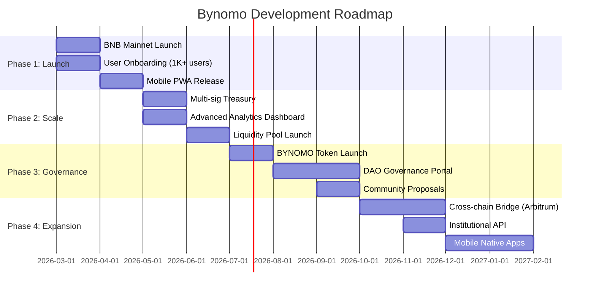

# Bynomo Roadmap

**Vision:** Become the leading on-chain binary options platform, the "Polymarket for Binary Options" on BNB Chain and beyond.

---

## Timeline & Milestones

---

## Q1 2026 (March - May) - **Foundation & Launch**

### ✅ Completed
- [x] Core binary options engine (Classic + Box modes)
- [x] BNB Chain integration (Wagmi, ConnectKit, Privy)
- [x] Pyth Hermes oracle integration (300+ assets)
- [x] House balance system (instant off-chain betting)
- [x] Supabase backend (balances, profiles, referrals, bet history)
- [x] Responsive UI with GridScan, Framer Motion
- [x] Demo mode for risk-free testing
- [x] Referral system and leaderboard
- [x] Tiered access (Free, Standard, VIP)
- [x] Blitz Rounds (2x multiplier boost)

### 🎯 In Progress
- [ ] BNB Mainnet deployment (treasury: ``)
- [ ] User onboarding campaign (target: 1,000+ users by April)
- [ ] Mobile PWA optimization (home screen install, offline support)
- [ ] Smart contract audit (treasury security review)
- [ ] Community Discord/Telegram launch

**Goal:** 1,000+ active users, $50K+ in treasury volume

---

## Q2 2026 (June - August) - **Security & Scalability**

### Treasury & Risk Management
- [ ] **Multi-sig treasury** (3-of-5 Gnosis Safe)
  - Hot wallet: $10K max for instant withdrawals
  - Cold wallet: Bulk reserves (multi-sig)
- [ ] **Insurance fund** (5% of protocol fees)
  - Coverage for oracle failures or smart contract exploits
- [ ] **Liquidity management**
  - Dynamic treasury rebalancing (70% BNB, 20% stablecoins, 10% yield)
  - Yield generation via Venus Protocol (BNB lending)

### Technical Improvements
- [ ] Advanced analytics dashboard
  - Live treasury health metrics
  - User cohort analysis
  - Asset-level P&L tracking
- [ ] API rate limiting and DDoS protection
- [ ] WebSocket price feeds (replace polling)
- [ ] Grafana monitoring + alerting

**Goal:** 5,000+ users, $250K+ treasury, 99.9% uptime

---

## Q3 2026 (September - November) - **Tokenomics & Governance**

### BYNOMO Token Launch
- [ ] **Token utility**:
  - Staking: Reduce protocol fees (1.5% → 0.5%)
  - Governance: Vote on treasury parameters, new asset listings
  - Rewards: Liquidity mining for treasury deposits
- [ ] **Fair launch**: 60% community airdrop, 20% team (2-year vest), 20% treasury
- [ ] **Liquidity pools**: BYNOMO/BNB on PancakeSwap
- [ ] **Yield farming**: Stake BYNOMO to earn protocol fee share

### DAO Governance
- [ ] On-chain proposal system (Snapshot or Tally)
- [ ] Community-driven asset additions (vote for new Pyth feeds)
- [ ] Treasury spend proposals (marketing, audits, grants)

**Goal:** 20,000+ users, $1M+ treasury TVL, token on 3+ DEXs

---

## Q4 2026 (December onwards) - **Expansion & Institutional**

### Cross-Chain Expansion
- [ ] Arbitrum deployment (lower fees, faster finality)
- [ ] Optimism and Base support
- [ ] Unified liquidity across chains (LayerZero bridge)

### Institutional Features
- [ ] REST API for algorithmic trading
  - Programmatic bet placement
  - Websocket real-time feeds
  - Historical data export
- [ ] White-label solution for partners
- [ ] Bulk treasury management (API-driven withdrawals)

### Mobile Native Apps
- [ ] iOS app (React Native or native Swift)
- [ ] Android app
- [ ] In-app notifications for bet settlements
- [ ] Biometric authentication

**Goal:** 50,000+ users, $5M+ treasury TVL, 10+ institutional partners

---

## Long-Term Vision (2027+)

### Product Expansion
- **Standard options** (calls/puts) on top of binary options infrastructure
- **Perpetual futures** with oracle-bound funding rates
- **Prediction markets** (events, sports, elections)
- **Social trading**: Copy trades from top performers

### Ecosystem Growth
- **Grants program** ($500K for dApp integrations)
- **Bug bounty program** (up to $50K for critical vulnerabilities)
- **Educational content** (trading academy, YouTube tutorials)
- **Partnerships** with Pyth, BNB Chain, DeFi protocols

### Revenue Diversification
- Protocol fees: 1.5-2% per bet
- Institutional API subscriptions: $500-$5K/month
- White-label licensing: $10K+ setup fee
- Token staking rewards (reduce sell pressure)

**Goal:** Become the #1 on-chain binary options platform globally, $50M+ TVL, 500K+ users

---

## Success Metrics (KPIs)

| Metric | Q1 2026 | Q2 2026 | Q3 2026 | Q4 2026 |
|--------|---------|---------|---------|---------|
| **Active Users** | 1,000 | 5,000 | 20,000 | 50,000 |
| **Treasury TVL** | $50K | $250K | $1M | $5M |
| **Daily Bet Volume** | $10K | $50K | $250K | $1M |
| **Protocol Revenue** | $200 | $1K | $5K | $20K |
| **Uptime** | 99.5% | 99.9% | 99.95% | 99.99% |

---

## How to Contribute

We welcome contributions from the community! See [CONTRIBUTING.md](./CONTRIBUTING.md) for guidelines.

- **Developers**: Submit PRs for features, bug fixes, or optimizations
- **Designers**: Improve UI/UX, create marketing assets
- **Traders**: Provide feedback, report bugs, suggest new assets
- **Community**: Join Discord/Telegram, help onboard new users

---

## Risk Mitigation

### Smart Contract Security
- Audit by CertiK or OpenZeppelin (Q2 2026)
- Bug bounty program via Immunefi
- Time-locked upgrades (48-hour delay)

### Oracle Reliability
- Pyth Network has 99.9%+ uptime SLA
- Fallback to Chainlink if Pyth fails (planned Q2)
- Circuit breaker: Pause bets if price deviation >5%

### Regulatory Compliance
- No KYC required (decentralized, non-custodial)
- Geo-blocking for restricted jurisdictions (US, UK planned)
- Legal opinion from crypto-focused law firm (Q2)

---

## Community & Open Source

- **Discord**: [Join our community](#) (coming soon)
- **Twitter**: [@BYNOMOProtocol](#) (coming soon)
- **Docs**: [docs.bynomo.xyz](#) (planned Q2)

---

**Last Updated:** February 27, 2026
