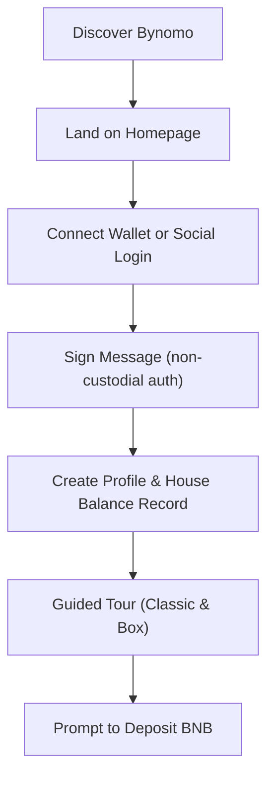
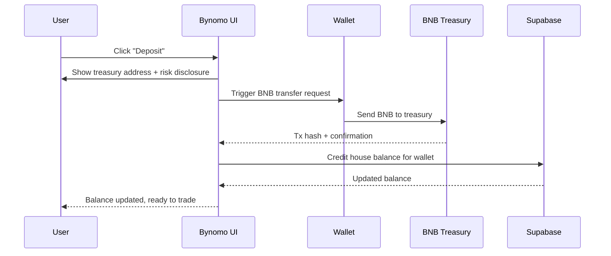
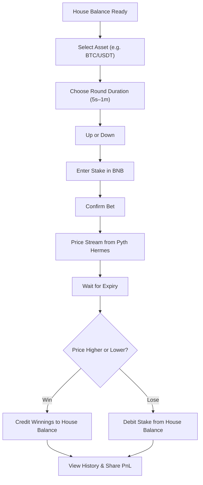
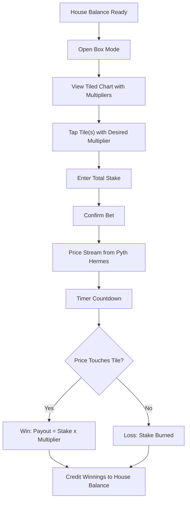
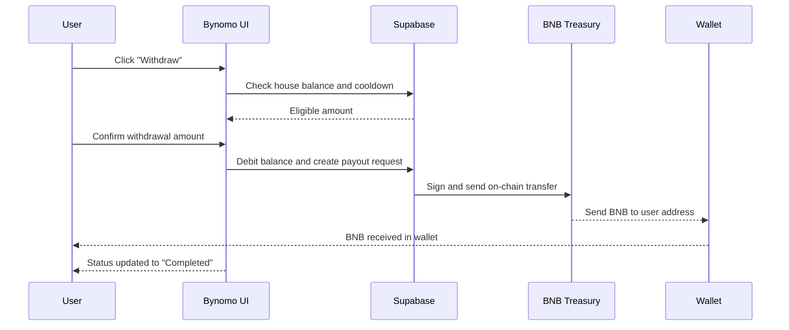
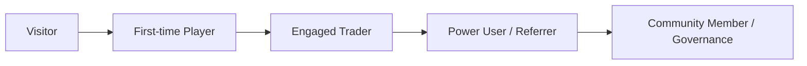

## User Journey

This document walks through the **end‑to‑end journey** for a typical Bynomo trader, from first touch to power user.

---

## 1. First-Time Onboarding

**Narrative**

- **Discovery**: User arrives from X/Twitter, TG communities, BNB Chain ecosystem pages, or referral links.
- **Trust building**: The homepage shows treasury address, audit/security links, and live markets.
- **Access**: User chooses MetaMask / WalletConnect / Privy social login; a signed message creates a **Supabase profile + house balance**.
- **Education**: Optional guided tour highlights Classic vs Box, treasury model, and oracle-based settlement before any deposit.

---

## 2. Deposit & Funding

**Key Moments**

- User chooses an amount (e.g. 0.2 BNB).
- UI displays estimated **rounds or tiles** they can play with that amount.
- Once confirmed on-chain, house balance updates instantly and becomes the **single source of truth** for all bets.

---

## 3. Classic Mode Trade Journey

**Micro-journey**

- User experiments with small stakes first (e.g. 0.001–0.005 BNB).
- UI shows **live price, countdown, and potential payout**.
- After several wins/losses, user views **PnL, hit-rate, and streaks** in the profile dashboard.

---

## 4. Box Mode Trade Journey

**Player Behaviour**

- Box Mode is optimized for **higher excitement** and **social sharing** (big multipliers).
- Users often play multiple tiles or sessions in a row.
- Leaderboards and streaks can highlight **largest multiplier hits** to drive virality.

---

## 5. Withdrawal Journey

**User Outcome**

- User can **exit fully** (0 balance) or **partially** (keep some for next sessions).
- UI encourages **re-deposit or re-engagement** via streaks, quests, or upcoming market events.

---

## 6. Lifecycle Stages

- **Visitor**: Cold traffic, campaign clicks, or organic search.
- **First‑time Player**: Completes at least one deposit + 3 trades.
- **Engaged Trader**: Weekly active, tracks PnL, uses both Classic and Box.
- **Power User / Referrer**: High volume, uses referral links, participates in promos.
- **Community Member**: Engaged in governance, feedback loops, and long‑term roadmap.

