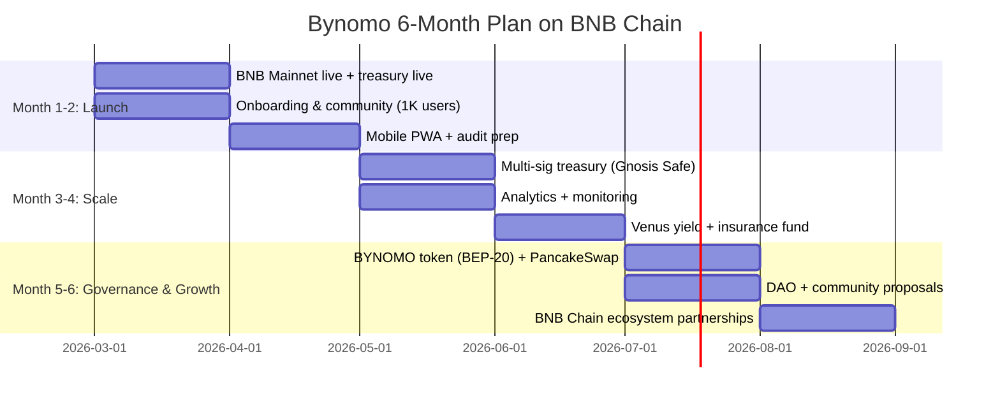

# Bynomo — 6-Month Dedicated Plan on BNB Chain

This document outlines Bynomo’s **6-month focused plan** to grow and operate exclusively on **BNB Chain (BSC)**. All milestones, metrics, and initiatives below are scoped to the BNB ecosystem. Cross-chain expansion is planned only after this period.

---

## Vision on BNB Chain

**Goal:** Establish Bynomo as the **first and leading on-chain binary options dApp on BNB Chain** — the go-to venue for short-duration, oracle-settled binary options (5s–1m) with transparent treasury and house balance.

**Why BNB Chain:** Low fees, fast finality (~3s), strong DeFi and retail user base, and alignment with Pyth Hermes and ecosystem grants make BSC the ideal launch chain.

---

## 6-Month Timeline Overview

---

## Month 1 — BNB Mainnet Launch & Stabilization

**Focus:** Production launch on BNB Chain, treasury live, first real users.

| Initiative | Description |
|------------|-------------|
| **Mainnet go-live** | Treasury EOA live on BSC mainnet; deposits/withdrawals in BNB; frontend and API on production domain. |
| **Documentation & ops** | README, TECHNICAL.md, USER_JOURNEY.md, bsc.address / bsc.address.json updated; runbooks for treasury and support. |
| **Monitoring** | Basic health checks (API, Supabase, Pyth); alerting on failed withdrawals or balance sync issues. |
| **Community channels** | Discord/Telegram for BNB Chain users; announce launch in BNB ecosystem (X, TG groups, forums). |

**Success metrics:**  
- Treasury address verified on BscScan; first 100+ depositors.  
- Zero critical incidents (no lost funds, no oracle mis-settlement).

---

## Month 2 — User Onboarding & Product Polish

**Focus:** Reach 1,000+ active users on BNB Chain; improve UX and trust.

| Initiative | Description |
|------------|-------------|
| **Onboarding campaign** | BNB Chain–focused landing, tutorials, and “first deposit + 3 trades” quest with optional reward (e.g. fee discount or badge). |
| **Mobile PWA** | Installable PWA; responsive trade/balance flows; optional push for round results. |
| **Security & compliance** | Engage auditor for treasury/withdrawal flow (no smart contract yet); prepare geo-blocking and risk disclaimer for restricted regions. |
| **Referral & leaderboard** | Promote referral program (10% fee share) and weekly leaderboards to drive organic growth on BNB. |

**Success metrics:**  
- 1,000+ registered/active users; $50K+ cumulative treasury volume.  
- PWA installs and returning user rate tracked.

---

## Month 3 — Security & Scalability on BNB

**Focus:** Multi-sig treasury, better analytics, and infra resilience — all on BNB Chain.

| Initiative | Description |
|------------|-------------|
| **Multi-sig treasury** | Migrate to **Gnosis Safe (3-of-5)** on BNB Chain: hot wallet cap (e.g. $10K) for instant withdrawals; bulk reserves in cold multi-sig. |
| **Advanced analytics** | Internal dashboard: treasury health, user cohorts, asset-level P&L, daily volume (BNB terms). |
| **Infrastructure** | API rate limiting; optional WebSocket for Pyth prices; Grafana (or equivalent) for uptime and error rates. |
| **BNB Chain ecosystem** | Apply for/report on BNB Chain grants or builder programs; one integration (e.g. wallet or analytics partner) on BSC. |

**Success metrics:**  
- Multi-sig live and documented in bsc.address.  
- 5,000+ users; $250K+ treasury TVL; 99.9% uptime target.

---

## Month 4 — Yield, Insurance & Liquidity Narrative

**Focus:** Treasury sustainability and user confidence on BNB Chain.

| Initiative | Description |
|------------|-------------|
| **Venus Protocol integration** | Deposit idle BNB into Venus on BSC for yield (~5% APY); define rebalancing rules (e.g. 70% BNB, 20% stablecoins, 10% yield). |
| **Insurance fund** | Allocate 5% of protocol fees to insurance fund; target $50K–$100K by end of month; document coverage (oracle failure, operational errors). |
| **Liquidity & transparency** | Public treasury and insurance metrics (e.g. on docs or dashboard); consider a small liquidity incentive (e.g. “early depositor” bonus) on BNB only. |
| **Community** | AMA or workshop with BNB Chain community; iterate on feedback (assets, rounds, UX). |

**Success metrics:**  
- Insurance fund balance visible and growing.  
- Treasury yield live on Venus (BSC); no withdrawal delays.

---

## Month 5 — BYNOMO Token (BEP-20) & Governance Prep

**Focus:** Native token on BNB Chain and path to community governance.

| Initiative | Description |
|------------|-------------|
| **BEP-20 token** | Launch **BYNOMO** on BNB Chain: utility (fee discount when staked), governance (treasury params, new Pyth assets), rewards (liquidity mining). |
| **Fair launch** | 60% community/airdrop, 20% team (2-year vest), 20% treasury; no pre-mine for insiders. |
| **PancakeSwap** | BYNOMO/BNB pool on PancakeSwap (BSC); initial liquidity from treasury/team. |
| **Governance portal** | Snapshot or Tally on BNB; first proposals: new asset listings, fee parameter tweaks. |

**Success metrics:**  
- BYNOMO live on BscScan; listed on PancakeSwap.  
- 20,000+ users; $1M+ treasury TVL; at least one community proposal executed.

---

## Month 6 — DAO, Partnerships & BNB Chain Anchoring

**Focus:** Community-led roadmap and lasting presence on BNB Chain.

| Initiative | Description |
|------------|-------------|
| **DAO & proposals** | Formalize proposal types: treasury spend (marketing, audits), asset additions, parameter changes; run 2+ community votes. |
| **BNB Chain partnerships** | At least one co-marketing or integration with a BNB Chain wallet, DEX, or incubator; participation in BNB Chain events/hackathons. |
| **Documentation & education** | Trading/risk education (oracle settlement, house edge); update all docs with 6-month learnings and tokenomics. |
| **Roadmap refresh** | Publish next 6–12 months: cross-chain (if any), institutional API, mobile apps — with BNB Chain remaining the primary chain. |

**Success metrics:**  
- DAO approved 2+ proposals.  
- 50,000+ users or $5M+ treasury TVL stretch; Bynomo recognized as a BNB Chain binary options flagship.

---

## Summary: BNB Chain–Only Commitment

| Month | Theme | Key deliverable |
|-------|--------|------------------|
| **1** | Launch | Mainnet live; treasury on BSC; first users |
| **2** | Growth | 1K users; PWA; audit prep; referral/leaderboard |
| **3** | Security & scale | Multi-sig treasury; analytics; 5K users |
| **4** | Sustainability | Venus yield; insurance fund; transparency |
| **5** | Token & governance | BYNOMO (BEP-20); PancakeSwap; Snapshot |
| **6** | DAO & ecosystem | Community proposals; BNB partnerships; roadmap |

All infrastructure, treasury, and token deployment in this 6-month window are **BNB Chain–native**. Cross-chain expansion is explicitly out of scope until this plan is delivered and BNB Chain is the established home chain.

---

## How to Share This Plan

- **Repository:** This file lives in the repo at [docs/BNB_CHAIN_6_MONTH_PLAN.md](../docs/BNB_CHAIN_6_MONTH_PLAN.md).  
- **README:** Linked from the main [README](../README.md) Documentation section.  
- **Evaluations:** This plan is part of the [evaluation repository](../README.md#evaluation-repository) and can be cited for grant or ecosystem applications.

**Last updated:** February 2026
