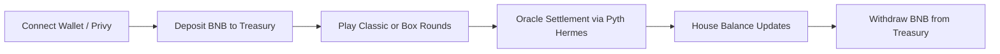

# Bynomo — Problem, Solution & Impact

One place for the **what** and **why** of Bynomo, optimized

---

## 1. Problem

- **Binary options are popular, but opaque.** Web2 platforms like Binomo/IQ Option are closed, custodial, and often operate in regulatory gray areas. Users have limited visibility into pricing, risk, or solvency.
- **On‑chain prediction markets don’t cover sub‑minute price bets.** Existing crypto prediction markets (e.g. Polymarket, Kalshi) focus on event outcomes with resolutions in hours/days, not **5s–1m price moves**.
- **DeFi options UX is too complex for casual traders.** On-chain options/derivatives protocols focus on calls/puts or perps; they require understanding greeks, collateralization, and leverage rather than simple “price up/down in 30 seconds”.
- **Latency + oracle constraints have blocked real‑time binary options.** To offer short-duration, fair binary options, you need **high-frequency, low-latency price feeds** and fast settlement—something most chains + oracles haven’t delivered until recently.

**Who is affected**

- **Retail traders** who want transparent, verifiable, on‑chain binary options rather than opaque Web2 brokers.
- **DeFi users on BNB Chain** who already trade perps and spot but lack a native binary options venue.
- **Ecosystem builders** (wallets, analytics, influencers) who need simple, engaging products they can plug into and promote.

**Why it matters**

- Binary options represent a **multi‑billion‑dollar market** in Web2 and a fast‑growing segment in crypto.
- Bringing this activity **on‑chain** aligns incentives, improves transparency, and drives **volume + users to BNB Chain**.
- Short‑duration products (5s–1m) are extremely engaging and shareable; done correctly, they can be a powerful **acquisition + retention loop** for the ecosystem.

---

## 2. Solution

### High-level approach

Bynomo is the **first on‑chain binary options trading dApp on BNB Chain**. It combines:

- **Pyth Hermes** for **millisecond‑grade price attestations** across 300+ assets.
- A **house balance** model (off‑chain ledger in Supabase) where only deposits/withdrawals hit the chain.
- **Two game modes** (Classic + Box) for different risk/reward and engagement profiles.

This lets users place **sub‑minute, oracle‑settled binary options** with low latency, low fees, and fully transparent settlement.

### Key Features

- **Classic Mode** — Simple “UP / DOWN” on an asset (e.g. BTC/USDT) over 5s–1m rounds with oracle‑bound resolution.
- **Box Mode** — Tap multipliers on a tiled price chart; win if price touches the tile before expiry (up to 10x payouts).
- **House Balance** — Users deposit BNB once, then place many bets off‑chain against their balance; only deposit/withdraw are on-chain txs.
- **BNB Chain Native** — Low fees, fast finality, and close alignment with the BNB ecosystem.
- **Transparent Treasury** — Single primary treasury address with clear reserves and planned upgrades to multi‑sig and smart‑contract vaults.

### Why this approach works

- **Performance**: Off‑chain execution + Pyth Hermes allows **1,000+ bets/second** with <100ms settlement latency.
- **UX**: No transaction popups per bet; users get a CEX‑like experience with on‑chain guarantees at deposit/withdraw boundaries.
- **Safety & future‑proofing**: The design phases toward **multi‑sig and smart‑contract vaults**, plus an insurance fund from protocol fees.

**User journey (short view)** — see `USER_JOURNEY.md` for a full breakdown:

---

## 3. Business & Ecosystem Impact

### Target users & adoption path

- **BNB Chain DeFi traders** looking for new high‑frequency products with simple UX.
- **Binary options / prediction market users** moving from Web2 platforms toward transparent, on‑chain venues.
- **Communities & KOLs** who need an exciting, easy‑to‑explain product to power content and engagement.

Adoption strategy (high‑level):

- Launch on **BNB mainnet**, then run **onboarding quests, referral programs, and streak‑based rewards** to bootstrap activity.
- Partner with **wallets, dashboards, and KOLs** for co‑marketing and embedded experiences.
- Expand asset coverage (crypto, FX, indices) using Pyth feeds to tap into broader user bases.

### Value to BNB Chain & ecosystem

- **Volume & users**: On‑chain deposits/withdrawals and high trading activity drive **transaction volume and address growth**.
- **Composable infra**: Bynomo’s oracle usage, treasury design, and data can be integrated into **analytics, structured products, and bots**.
- **Showcase for Pyth Hermes + BNB**: Demonstrates real‑time oracle usage and BNB Chain’s low‑latency capabilities with a clear, understandable UX.

### Monetization & sustainability

- **Protocol fees** (1.5–2% per bet) allocated to:
  - Treasury reserves
  - Insurance fund
  - Team + community incentives
- **Referral fees**: Long‑term fee share for referrers.
- **Future token utility**: BYNOMO token for fee discounts, governance, and liquidity incentives (see `ROADMAP.md` for full tokenomics).

---

## 4. Limitations & Future Work

### Current limitations / risks

- **Single treasury EOA (Phase 1)** — Current implementation uses a single treasury address on BNB Chain (see `bsc.address`), with planned upgrade to multi‑sig and smart‑contract vaults.
- **Oracle dependency** — Settlement quality depends on **Pyth Hermes** performance and availability; circuit breakers are planned for extreme deviation events.
- **Regulatory uncertainty** — Binary options have varying regulatory treatment across jurisdictions; Bynomo is infrastructure and may require per‑region front‑end access policies.

### Short‑term roadmap

- Deploy to **BNB mainnet**, finalize **multi‑sig treasury**, and harden monitoring/alerts.
- Ship **advanced analytics**, **demo mode refinements**, and improve mobile UX.
- Run targeted **BNB ecosystem campaigns** and community trading competitions.

### Longer‑term roadmap

- Launch **BYNOMO token**, DAO‑style governance, and liquidity mining.
- Expand to **additional chains** (e.g. Arbitrum) with unified liquidity.
- Release **institutional APIs** for bots, market‑makers, and partner integrations.

> For a detailed timeline, see `ROADMAP.md`. For a deep technical breakdown and setup instructions, see `docs/TECHNICAL.md` and `DEVELOPER_GUIDE.md`.

