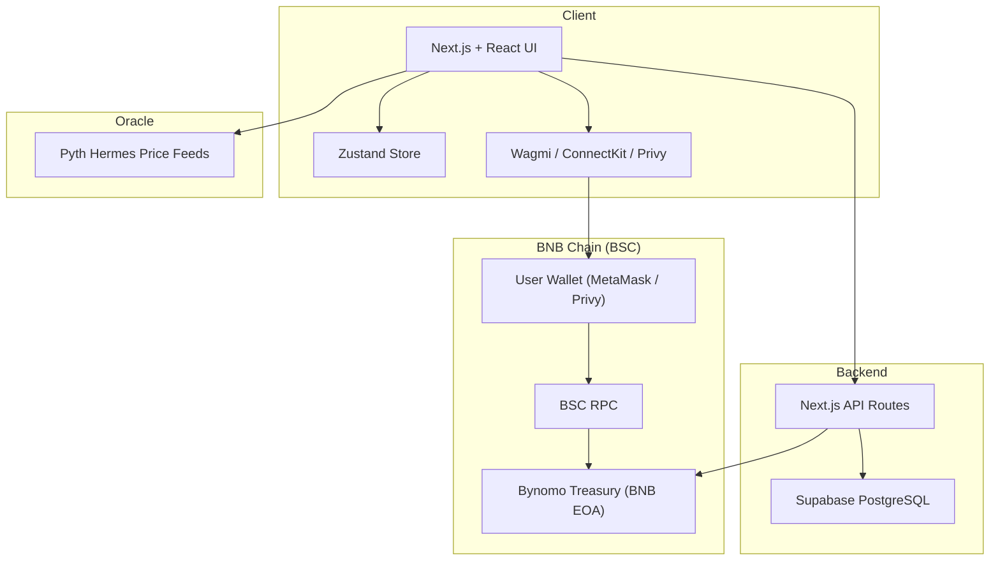
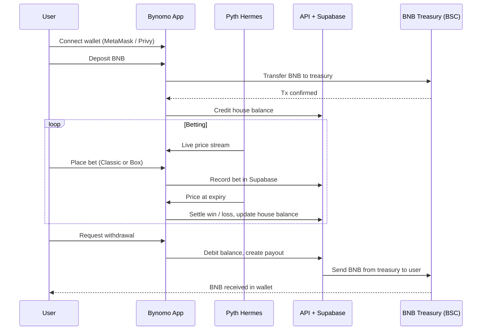

# Bynomo Technical — Architecture, Setup & Demo

One place for **how Bynomo works** and how to **run and demo** it quickly, optimized. For a deeper contributor guide, see `DEVELOPER_GUIDE.md`.

---

## 1. Architecture

### System Overview

Bynomo is a **Next.js 16 + React 19** app deployed on **BNB Chain (BSC)** with:

- **Frontend**: Next.js App Router UI, Tailwind CSS, Zustand for state.
- **On-chain layer**: Single BNB treasury EOA on BNB Chain (deposits/withdrawals only).
- **Oracle**: **Pyth Hermes** price feeds for sub‑minute binary options.
- **Backend**: Next.js API routes + **Supabase (PostgreSQL)** for balances, bets, referrals, and logs.

High‑level component diagram:



### Data Flow



### On-chain vs Off-chain

- **On-chain**
  - BNB deposits into a **single treasury EOA** (see `bsc.address`).
  - BNB withdrawals from treasury back to user wallets.
- **Off-chain**
  - House balances, bet records, referrals, and session data stored in **Supabase**.
  - Bet placement and settlement are processed off‑chain using Pyth prices; only net deposits/withdrawals touch the chain.

### Security & Risk Mitigation (Phase 1)

- **Treasury**
  - Single EOA with controlled keys (moving to multi‑sig + vaults per `ROADMAP.md`).
  - Operational limits on withdrawal size and monitoring for anomalies.
- **Oracle**
  - Pyth Hermes with planned **circuit breakers** for large price deviations.
  - Insurance fund funded from protocol fees (see `README.md` revenue model).
- **Backend & DB**
  - Supabase row‑level security for user data.
  - Separation of public/secret keys; secrets never exposed to client.

### Contract & deployment addresses

- **Root (human-readable):** [`/bsc.address`](../bsc.address) — BNB Chain addresses in TOML-style format.
- **Docs (JSON schema):** [`docs/bsc.address.json`](./bsc.address.json) — Same info in structured JSON for tooling and hackathon submission:

| Field | Purpose |
|-------|--------|
| `projectName` | Bynomo |
| `network` | BSC Testnet (or BSC Mainnet when deployed) |
| `contracts` | Array of name, address, explorerLink, description (e.g. BynomoTreasury EOA) |
| `frontendUrl` | Live app URL |
| `backendApi` | Base API URL |
| `notes` | Special instructions for judges / integrators |

Fill in real treasury address, `frontendUrl`, and `backendApi` before submission. For local runs, use `http://localhost:3000` and the API is the same origin.

---

## 2. Setup & Run

For full contributor instructions, see `DEVELOPER_GUIDE.md`. This section is the **shortest path** for a judge to run the app.

### Prerequisites

- **Node.js**: v18+ (v20 LTS recommended)
- **Yarn** (or npm)
- **Git**
- **BNB Chain wallet** (MetaMask or similar)  
  - For local demo on testnet, you can use BSC testnet with faucet BNB.
- **Supabase project** (free tier is enough)

### Environment

1. Copy the example environment:

```bash
cp .env.example .env
```

2. Fill in minimum required values in `.env`:

- `NEXT_PUBLIC_BNB_NETWORK` — `testnet` or `mainnet`
- `NEXT_PUBLIC_BNB_RPC_ENDPOINT` — BSC RPC (testnet or mainnet)
- `NEXT_PUBLIC_WALLETCONNECT_PROJECT_ID` — from WalletConnect Cloud
- `NEXT_PUBLIC_SUPABASE_URL` and `NEXT_PUBLIC_SUPABASE_ANON_KEY`
- `NEXT_PUBLIC_TREASURY_ADDRESS` — set to the treasury in `bsc.address` (for mainnet) or your own testnet wallet (for local testing)

> You can keep other envs at defaults or dummy values for a basic local run. See `DEVELOPER_GUIDE.md` for full variable descriptions.

### Install & Build

```bash
git clone https://github.com/0xamaan-dev/Bynomo.git
cd Bynomo
yarn install
```

No separate build step is required for local development (`yarn dev` runs the app in dev mode).

### Run

```bash
yarn dev
```

Then open:

- `http://localhost:3000` → automatically redirects to `/trade`

You should see the Bynomo trading interface with asset selector, chart, and Classic/Box modes.

### Environment config safety

- All secrets and keys are **externalized** via `.env`; see [.env.example](../.env.example).
- The repo provides `.env.example` with placeholders; **never commit `.env`** (it is in [.gitignore](../.gitignore)).
- No API keys or private keys are hardcoded in source; the app reads only `process.env.*`.

### Verify

At minimum, to confirm the app is working:

- The landing page loads without errors.
- You can open the connect wallet dialog (MetaMask / WalletConnect / Privy).
- Price feed and chart update periodically (when correctly configured with Pyth).
- UI state updates when switching assets and modes.

---

## 3. Demo Guide

This section describes **one suggested demo flow** for judges.

### Access

1. Start the dev server:

```bash
yarn dev
```

2. Open `http://localhost:3000` (redirects to `/trade`).

### User Flow (Classic Mode)

1. **Connect**  
   - Click “Connect Wallet” and choose MetaMask or Privy (social login).
2. **Deposit (testnet or mainnet)**  
   - On testnet: send a small amount of BNB from your wallet to the treasury (or your configured test treasury).
   - Wait for confirmation; the **house balance** in the UI should update.
3. **Place a Classic bet**  
   - Select an asset (e.g. BTC/USDT) and a short duration (e.g. 30s).
   - Choose **UP** or **DOWN**, enter a small stake, and confirm.
   - Watch the countdown; at expiry, Bynomo uses **Pyth Hermes** to resolve the outcome and adjusts your house balance.
4. **Review history**  
   - Open the history panel to see the bet result and PnL.

### User Flow (Box Mode)

1. Switch to **Box Mode** in the UI.
2. Tap one or more tiles with desired multipliers (e.g. 3x, 5x).
3. Enter a total stake and confirm.
4. If price **touches the tile before expiry**, you win; otherwise you lose. Winnings and losses are applied to your house balance.

### Expected Outcomes

- **House balance** updates correctly after wins/losses.
- **Charts and timers** behave smoothly during the round.
- Bets are **stored and retrievable** from history (backed by Supabase).

### Troubleshooting

- **Blank screen or build error**  
  - Ensure Node 18+ and a clean install: `rm -rf node_modules .next && yarn install && yarn dev`.
- **Wallet connection issues**  
  - Confirm the wallet network matches `NEXT_PUBLIC_BNB_NETWORK`.
  - Check `NEXT_PUBLIC_WALLETCONNECT_PROJECT_ID` is valid.
- **No price data**  
  - Verify Pyth configuration and that you have set appropriate envs for Hermes endpoints (see `DEVELOPER_GUIDE.md`).

> For more detailed troubleshooting and production deployment notes, see `DEVELOPER_GUIDE.md` and `README.md` (Architecture & Scalability sections).

